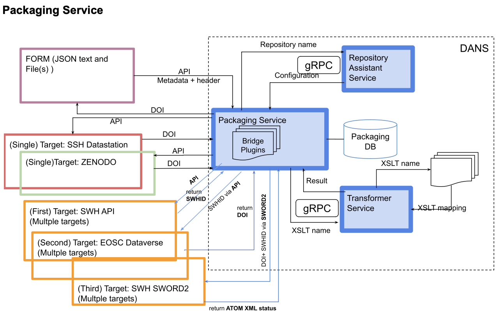
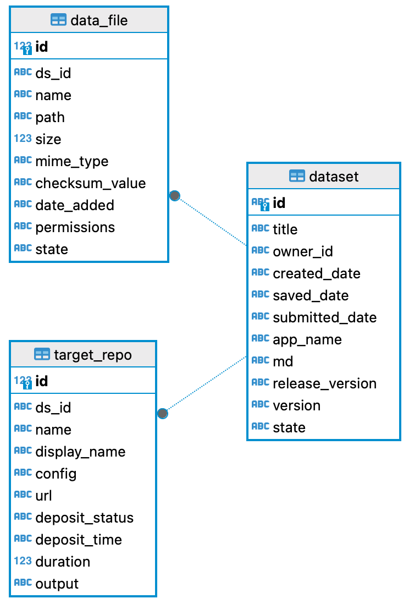

# Packaging Service
At DANS we have developed a packaging service which creates deposit packages based on user input that consist of metadata, files and repository targets. 

The Packaging Service is designed to streamline and simplify the creation of deposit packages which harmonizes user input, repository configurations, bridge modules, and transformers to effortlessly create deposit packages tailored to the specific needs of each repository target. 

The packaging process is orchestrated based on the specific repository target(s) specified by the user. The packaging service dynamically retrieves the requisite configuration from the given configuration’s name in the repository assistant service which encompasses essential details such as the repository URL, the bridge module, and transformer(s).

The repository URL within the configuration file serves as the link to the designated storage location, allowing seamless interaction with the repository. The bridge module, a pivotal component, plays a key role in crafting the deposit package in the desired target format, exemplified by formats like SWORD. This adaptable module ensures that the packaged content aligns seamlessly with the requirements of the chosen repository. The transformer(s) are responsible for facilitating the translation of metadata to match the specifications of the destination repository. This ensures that the deposited content is not only packaged appropriately but also conforms to the metadata requirements of the target repository

 ## Database Schema

    